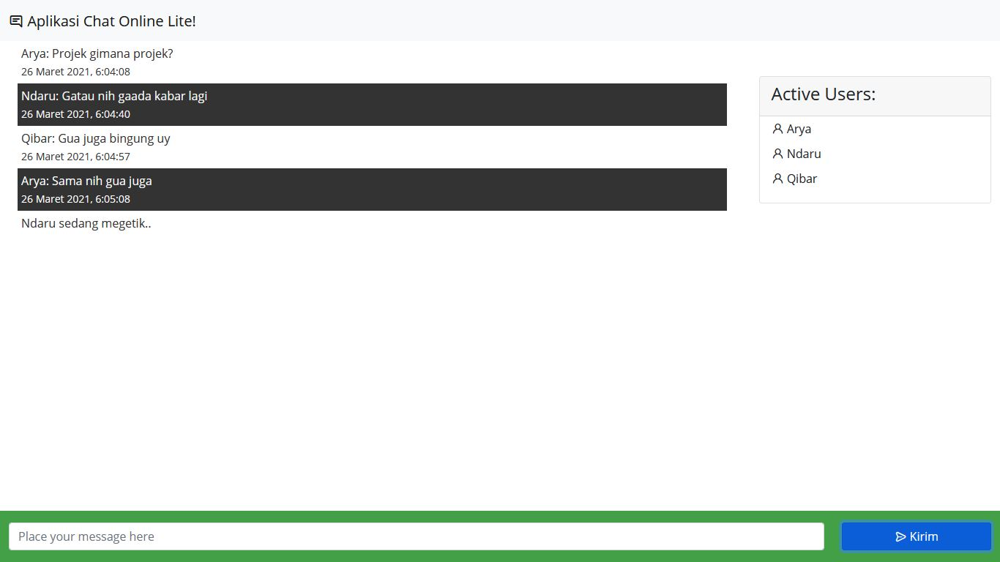
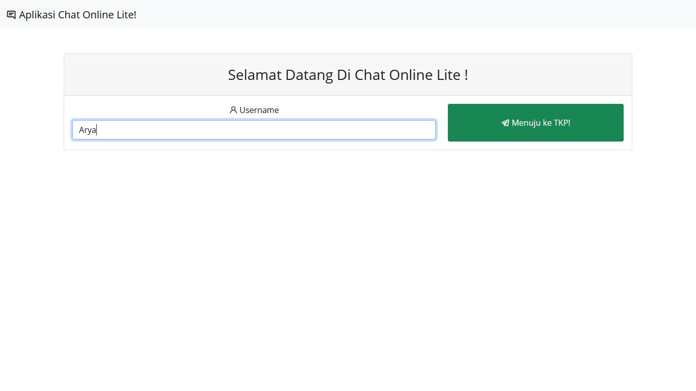
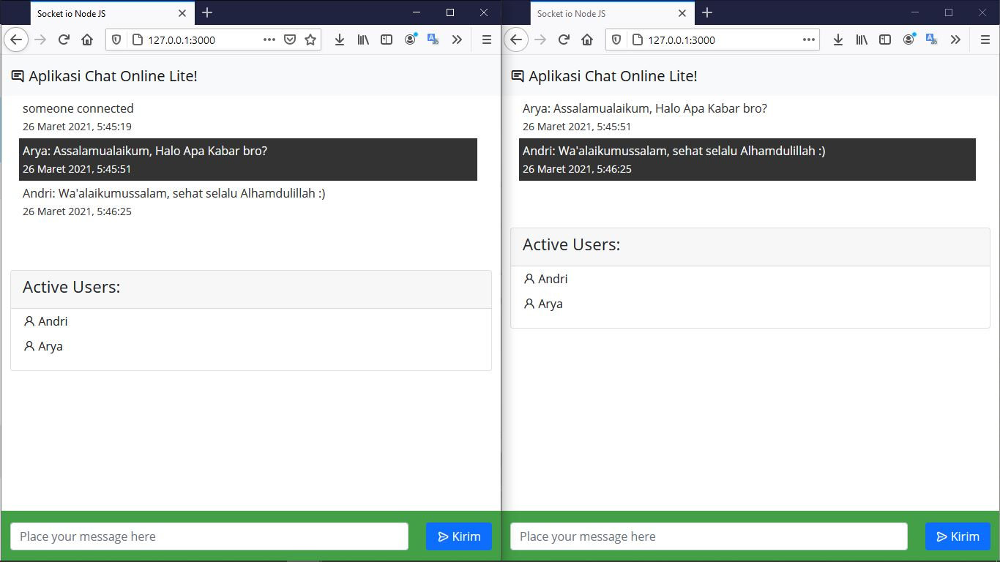
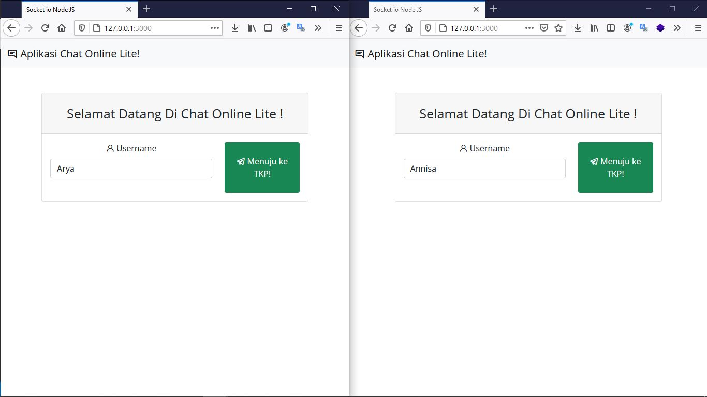

<h1 align="center">Aplikasi Chat Online</h1>
<h3 align="center">Build with NodeJS & Socket.io</h3>



## Deskripsi
<p> Saya membuat aplikasi ini karena iseng aja sih 😄 tapi jika kalian ingin mencoba mengembangkannya, silahkan dinikmati 🥰 </p>

## Screenshoot




## Setup Projek
<p>Silahkan dibuka terlebih dahulu terminalnya<p>
<h5>install & Jalankan server nya dengan mengetik kode dibawah ini</h5>
 
```
npm install || Install Package Node Modules
node server || Menjalankan Server Node JS
```

<p>lalu buka 2 tab atau lebih aplikasi web dan isikan nama username kalian, dan aplikasi sudah siap untuk digunakan<p>



<h3 align="center"> Selamat Mencoba 😸 </h3>